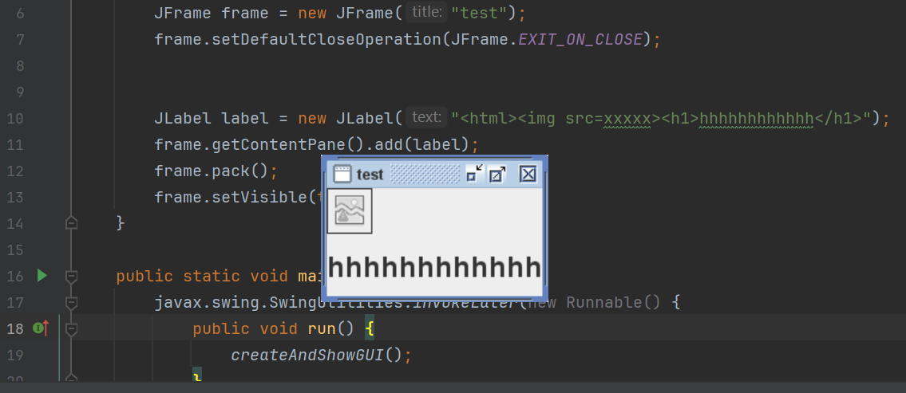
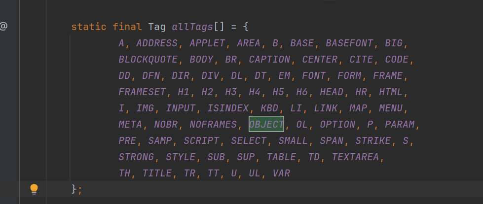
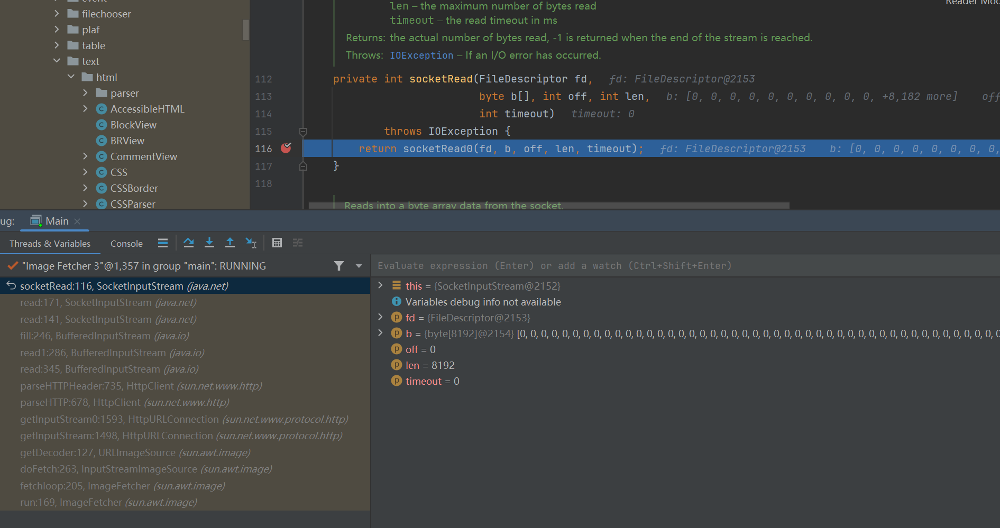
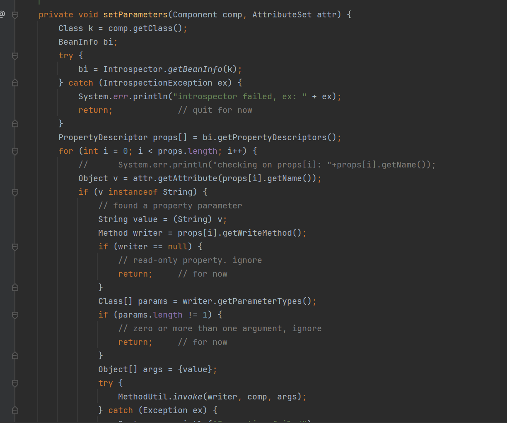
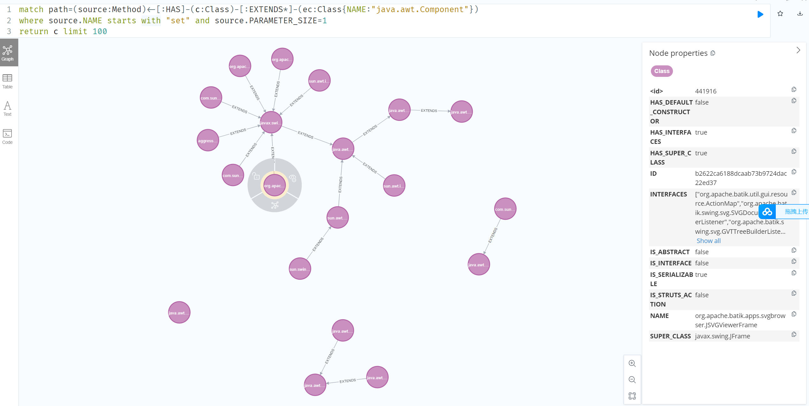

# Swing 标签解析

[https://docs.oracle.com/javase/tutorial/uiswing/components/html.html](https://docs.oracle.com/javase/tutorial/uiswing/components/html.html)

根源来自于CS 的UI构建使用swing，而swing支持某些html标签的解析

测试解析demo如下

```java
import javax.swing.*;
public class test {

    private static void createAndShowGUI() {
        JFrame.setDefaultLookAndFeelDecorated(true);
        JFrame frame = new JFrame("test");
        frame.setDefaultCloseOperation(JFrame.EXIT_ON_CLOSE);


        JLabel label = new JLabel("<html><h1>hhhhhhhhhhhh</h1>");
        frame.getContentPane().add(label);
        frame.pack();
        frame.setVisible(true);
    }

    public static void main(String[] args) {
        javax.swing.SwingUtilities.invokeLater(new Runnable() {
            public void run() {
                createAndShowGUI();
            }
        });
    }
}
```



# IMG解析触发请求

javax.swing.text.html.HTML.Tag#allTags 定义了swing支持解析的标签




不同的标签有不同的VIEW对应去解析处理此标签，以img为例，一个img标签会触发http请求，最终会走到javax.swing.text.html.ImageView#loadImage ，新起一个线程来发起sockt请求，主线程调用栈如下

```plain
wait:-1, Object (java.lang)
waitForID:677, MediaTracker (java.awt)
loadImage:314, ImageIcon (javax.swing)
setImage:381, ImageIcon (javax.swing)
loadImage:704, ImageView (javax.swing.text.html)
refreshImage:673, ImageView (javax.swing.text.html)
sync:645, ImageView (javax.swing.text.html)
getPreferredSpan:443, ImageView (javax.swing.text.html)
getPreferredSpan:732, FlowView$LogicalView (javax.swing.text)
calculateMinorAxisRequirements:233, FlowView (javax.swing.text)
calculateMinorAxisRequirements:717, ParagraphView (javax.swing.text)
calculateMinorAxisRequirements:157, ParagraphView (javax.swing.text.html)
checkRequests:935, BoxView (javax.swing.text)
getMinimumSpan:568, BoxView (javax.swing.text)
getMinimumSpan:270, ParagraphView (javax.swing.text.html)
calculateMinorAxisRequirements:903, BoxView (javax.swing.text)
calculateMinorAxisRequirements:146, BlockView (javax.swing.text.html)
checkRequests:935, BoxView (javax.swing.text)
getMinimumSpan:568, BoxView (javax.swing.text)
getMinimumSpan:378, BlockView (javax.swing.text.html)
calculateMinorAxisRequirements:903, BoxView (javax.swing.text)
calculateMinorAxisRequirements:146, BlockView (javax.swing.text.html)
checkRequests:935, BoxView (javax.swing.text)
getPreferredSpan:545, BoxView (javax.swing.text)
getPreferredSpan:362, BlockView (javax.swing.text.html)
<init>:383, BasicHTML$Renderer (javax.swing.plaf.basic)
createHTMLView:67, BasicHTML (javax.swing.plaf.basic)
updateRenderer:207, BasicHTML (javax.swing.plaf.basic)
installComponents:381, BasicLabelUI (javax.swing.plaf.basic)
installUI:343, BasicLabelUI (javax.swing.plaf.basic)
setUI:666, JComponent (javax.swing)
setUI:261, JLabel (javax.swing)
updateUI:275, JLabel (javax.swing)
<init>:164, JLabel (javax.swing)
<init>:194, JLabel (javax.swing)
createAndShowGUI:10, Main
```
图片请求线程如下



# Object标签解析

大概模糊的了解了标签解析，接下来就该逐一看每个标签解析都会产生什么样危险逻辑，当然有那么多分析文章我们这里就很没脸的掠过了，直接将目光定位到ObjectView 

javax.swing.text.html.ObjectView#createComponent

```plain
protected Component createComponent() {
    AttributeSet attr = getElement().getAttributes();
    String classname = (String) attr.getAttribute(HTML.Attribute.CLASSID);
    try {
        ReflectUtil.checkPackageAccess(classname);
        Class c = Class.forName(classname, true,Thread.currentThread().
                                getContextClassLoader());
        Object o = c.newInstance();
        if (o instanceof Component) {
            Component comp = (Component) o;
            setParameters(comp, attr);
            return comp;
        }
    } catch (Throwable e) {
        // couldn't create a component... fall through to the
        // couldn't load representation.
    }

    return getUnloadableRepresentation();
}
```
可以实例化Component子类



必须有无参构造方法

必须存在一个setXXX方法的XXX属性

setXXX方法的传参数必须是接受一个string类型的参数

# Tabby查找符合条件类

好的，让我们打开tabby，上面这些条件转化为tabby语法如下(遇到点小问题，感谢wh1t3Pig指点)

```plain
match path=(source:Method)<-[:HAS]-(c:Class)-[:EXTENDS*]-(ec:Class{NAME:"java.awt.Component"})
where source.NAME starts with "set" and source.PARAMETER_SIZE=1
return c limit 100
```



```plain
<html><object classid='org.apache.batik.swing.JSVGCanvas'><param name='URI' value='payload'></param></object>
```
接下来就是SVG利用链的过程，到点下班了详情参考
[https://todis21.github.io/2022/10/30/CVE-2022-39197%E5%AD%A6%E4%B9%A0%E7%AC%94%E8%AE%B0/](https://todis21.github.io/2022/10/30/CVE-2022-39197%E5%AD%A6%E4%B9%A0%E7%AC%94%E8%AE%B0/)

# 参考链接

[https://mp.weixin.qq.com/s?__biz=MzIxNDAyNjQwNg==&mid=2456098978&idx=1&sn=d511d5a674d84eeaf262c8e389ae0403&chksm=803c696bb74be07d8ef8e473b11ffe4dce57b58ccf82e8615ab15d9ba6bba9263360c01276a8&mpshare=1&scene=23&srcid=1012cGc5X3pyXr5VpF2LMf7Y&sharer_sharetime=1665577816700&sharer_shareid=685f4dccaa04150832e24b9e6499e6cf#rd](https://mp.weixin.qq.com/s?__biz=MzIxNDAyNjQwNg==&mid=2456098978&idx=1&sn=d511d5a674d84eeaf262c8e389ae0403&chksm=803c696bb74be07d8ef8e473b11ffe4dce57b58ccf82e8615ab15d9ba6bba9263360c01276a8&mpshare=1&scene=23&srcid=1012cGc5X3pyXr5VpF2LMf7Y&sharer_sharetime=1665577816700&sharer_shareid=685f4dccaa04150832e24b9e6499e6cf#rd)

[https://todis21.github.io/2022/10/30/CVE-2022-39197%E5%AD%A6%E4%B9%A0%E7%AC%94%E8%AE%B0/](https://todis21.github.io/2022/10/30/CVE-2022-39197%E5%AD%A6%E4%B9%A0%E7%AC%94%E8%AE%B0/)


