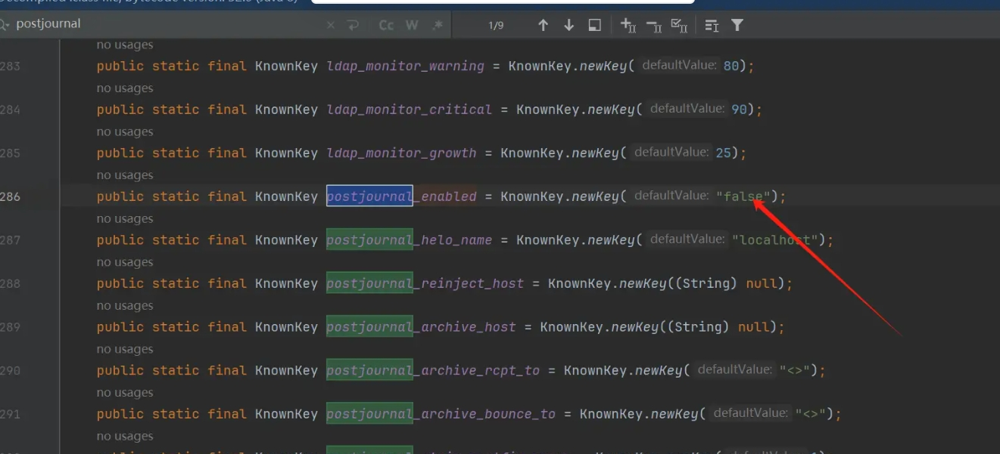
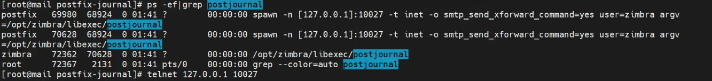
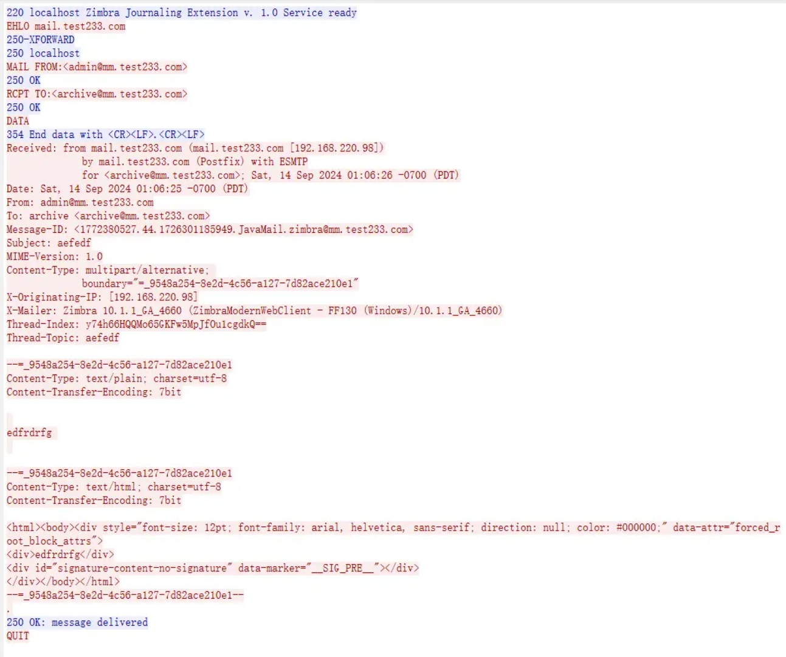
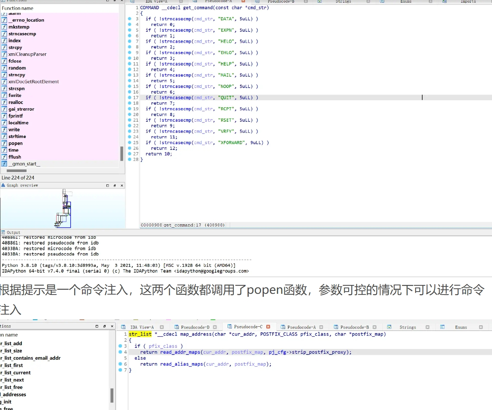
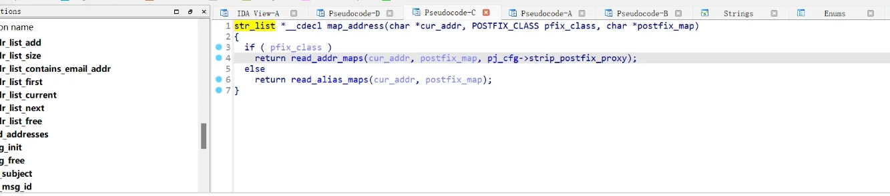
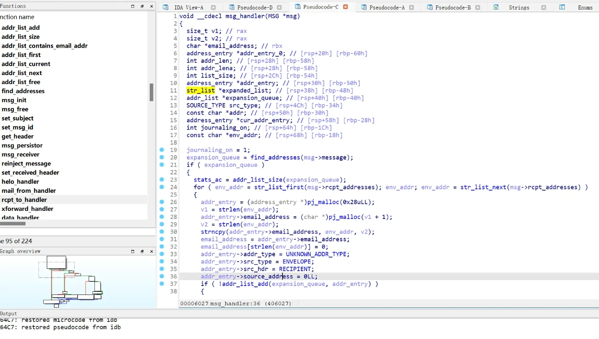
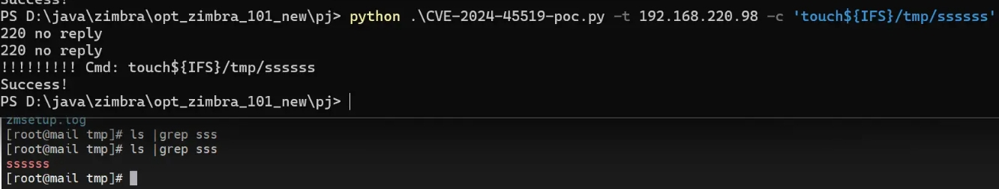

看到赛博昆仑发了一个zimbra的漏洞公告，正好有旧版本的环境，diff了一下发现二进制相关功能postjournal和jar包均有改动，本俩想着如果是二进制的洞就放弃了，可是听说是个命令注入，正好电脑上还有没被我卸载的ida，勉强试一试

首先根据公告

>在远程 Zimbra 服务器开启了 postjournal 服务时，未授权的远程攻击者可构造特殊的请求包发送至远程的Zimbra系统，在目标系统中执行命令，从而获取目标系统的服务器权限。
需要开启postjournal服务，这里搜索官方文档尝试两个小时一直无法开启此功能，沉思了一下，根据我对zimbra代码的了解，决定采取一个比较笨的方法开启

com.zimbra.common.localconfig.LC 可以理解为Zimbra的一个整体配置类，搜索postjournal关键字，手动修改这个值，开启

经过jar包替换，发现功能完美的被开启了

而且是在本机监听了10027端口，但是具体什么服务现在还不清楚

尝试tcpdump抓取10027端口的通信流量，手动在zimbra前端点点点尽可能把功能都点一遍， 触发流量(根据对postjournal一些搜索了解到可能是邮件的归档功能)

抓取的流量如图，豁然开朗，这不就是邮件原文么。

Web方面的就进行到这里，接下来我们打开ida！F5后我可以看到比较熟悉的代码，根据抓取到流量，找到了这个方法，也就是支持的指令

根据提示是一个命令注入，这两个函数都调用了popen函数，参数可控的情况下可以进行命令注入

最终可以溯到msg_handler方法

最终构造

RCPT TO:<2|cmd|@test233.com>\r\n

复现

