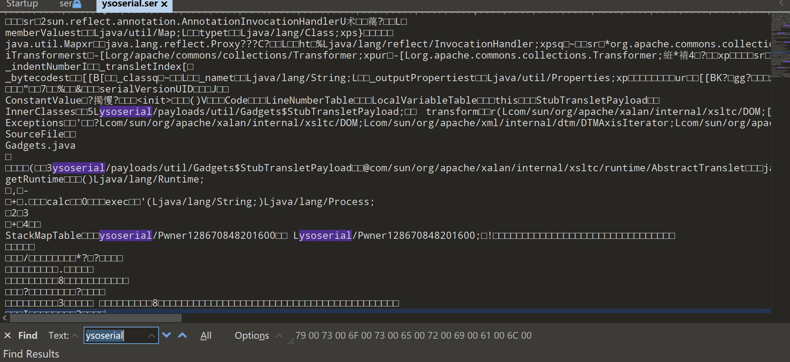
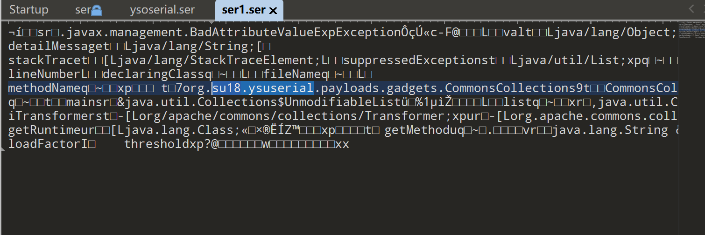
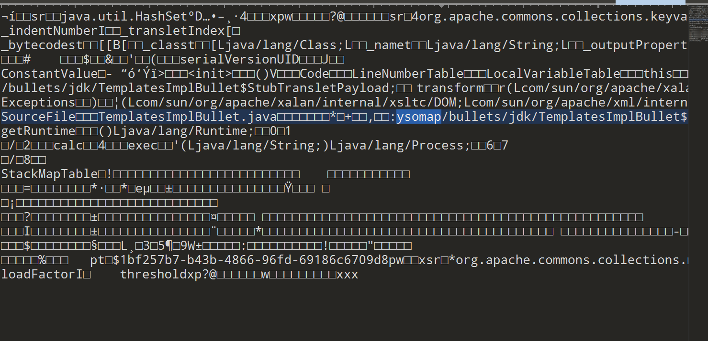
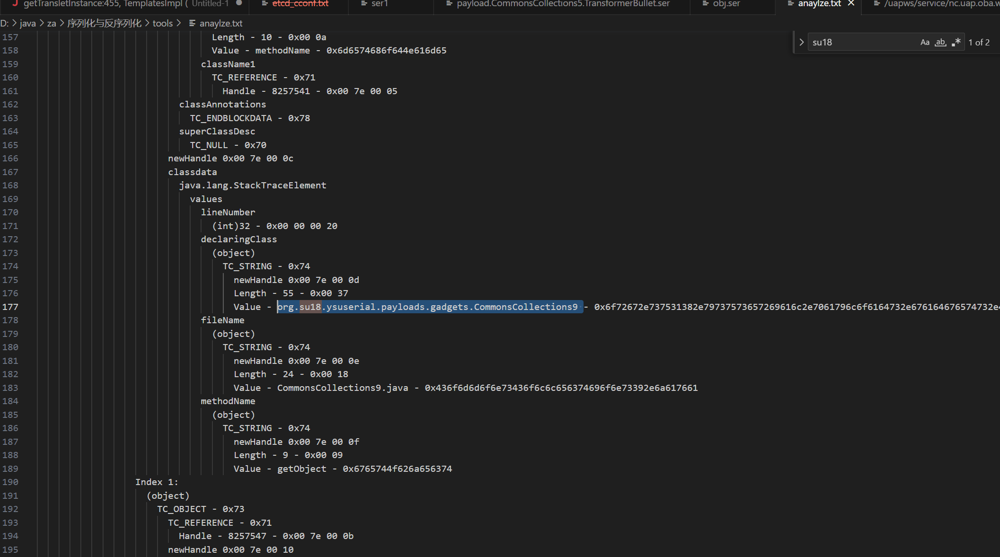
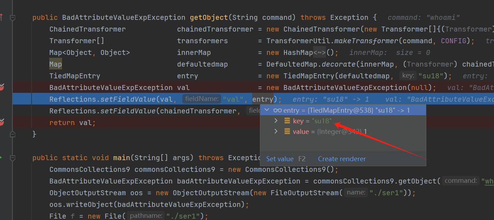
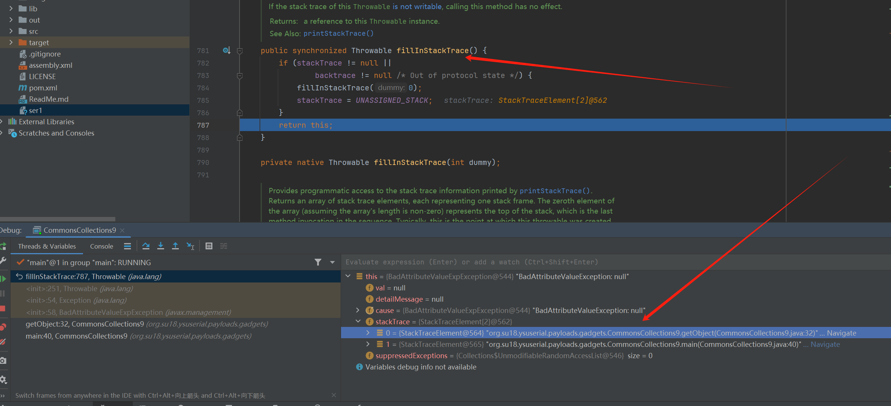
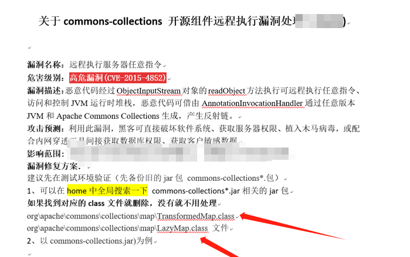

# 盘点那些失效的反序列化防护

最近代码审计遇到了一些反序列化防护措施，以及我采用的绕过方法。

反序列化防护措施可以归为这几类：

* 输入验证
* 序列化过滤
* 序列化加密
* 使用安全的序列化库
* 限制反序列化

# 一、输入验证

在反序列化之前，对输入数据进行严格的验证。检查数据类型、长度、格式和内容，确保只有符合要求的数据才会被反序列化。可以使用输入过滤器和数据验证库来简化输入验证。

## 1.针对攻击特征关键字过滤1

原生反序列化漏洞利用中，攻击者大多数情况下利用开源工具进行攻击，如ysoserial、ysomap或者ysoserial自定义版本

### (1) ysoserial

我们用ysoserial生成一段原生反序列化数据

java -jar .\ysoserial-0.0.6-SNAPSHOT-all.jar CommonsCollections3 calc > ysoserial.ser

可以看到有很多工具自带的关键字




### (2)定制化版本的ysoserial

查看生成的数据可以看到还是存在工具作者信息及工具关键字




### (3) Ysomap 

Ysomap生成数据如下,同时也存在工具特征关键字




### (3)规避与绕过

#### (1) 特征存在原理分析

首先我们来看为什么反序列化数据会包含一些攻击者相关信息，以CommonsCollections9为例，使用工具分析下工具生成的序列化数据信息




我们调试一下生成序列化数据的工具代码，有两处写入了工具作者信息，首先是一处类属性，这里可以是任意字符串


其次BadAttributeValueExpException本身为异常类，创建异常对象时会调用父类Throwable的fillInStackTrace()方法生成栈追踪信息，也就是调用native的fillInStackTrace()方法去爬取线程堆栈信息，也就会将生成工具全类名写入stackTrace属性当中，反序列化时对stackTrace值进行反序列化，写入POC中




PS：当然了，也不是工具生成的所有反序列化数据都会自带攻击者信息，看具体使用的target类，其它反序列化链这里就不一一分析了

#### (2) 特绕过方法

直接将我们工具开发包名进行重命名，使用常见类包名即可

## 2.针对攻击特征关键字过滤2

很多情况下反序列化漏洞利用的类及方法正常业务逻辑中是使用不到的，攻击POC具有明显特征例如,以CC链为例

org.apache.commons.collections.map.DefaultedMap

org.apache.commons.collections.keyvalue.TiedMapEntry

org.apache.commons.collections.Transformer

org.apache.commons.collections.functors.InvokerTransformer

org.apache.commons.collections.map.LazyMap

..................(其它链有更多特征类不再一一列举)

如果采取这样过滤方式，如果过滤的全面那公开的链条确实没有很好的绕过方式，不过可以在项目本身寻找其它反序列化链，不过这个难度会大大增加以及极有可能找不到很好用的链。

### (1)一个失败的防护例子

这里举例某应用过滤不全面导致绕过的例子，应用采取的修复方式为删除常用反序列化链条中的关键类如LazyMap、TemplatesImpl 等




其实在未对反序列化了解清楚的情况下盲目的删除几个类远远达不到防护的效果，

org.apache.commons.collections.functors.ChainedTransformer可以替代TemplatesImpl ，Lazy可以替换成DefaultedMap，很简单的绕过了其防护

# 二、序列化过滤

对序列化的数据进行过滤，只允许序列化预期的数据类型和对象。可以使用序列化过滤器来实现此操作。

原生反序列化 readObject() 反序列化时会调用 resolveClass 方法读取反序列化的类名，可以通过hook该方法来校验反序列化的类，Demo如下

```plain
protected Class<?> resolveClass(ObjectStreamClass desc) throws IOException, ClassNotFoundException {
    if (!desc.getName().equals(white.class.getName())) {
        throw new InvalidClassException(
                "attack",
                desc.getName());
    }
    return super.resolveClass(desc);
}
```
以上代码只允许white类进行反序列化，可以说很安全了
### (1)一个失败的防护例子

但是往往开发者还会给你意想不到的惊喜

```plain
protected Class<?> resolveClass(ObjectStreamClass desc) throws IOException, ClassNotFoundException {
    Class<?> superImpl = super.resolveClass(desc);
    if (!this.check && (!Map.class.isAssignableFrom(superImpl))
          && (!Hashtable.class.isAssignableFrom(superImpl))
          && (!RequestEntry.class.isAssignableFrom(superImpl))) {
       throw new IllegalArgumentException("####### class::" + superImpl);
    }
    if(URL.class.isAssignableFrom(superImpl)) {
       throw new IllegalArgumentException("####### class::" + superImpl);
    }
    this.check = true;
    return superImpl;
}
```
它添加了this.check = true;后，只要反序列化最外层类为白名单中的类，那么后续的反序列化方法将不会走校验逻辑23333333
# 三、序列化加密

在序列化数据之前，使用加密算法对数据进行加密，防止攻击者篡改数据。在反序列化时，先解密数据，再进行反序列化。

这样面对黑盒测试比较安全，但是代码审计的情况下很容易本地构造加密序列化数据进行绕过

# 四、使用安全的序列化库

使用可信任的序列化库，如JSON或XML序列化库，而不是不安全的序列化库，如Java的ObjectInputStream或.NET的BinaryFormatter。可信任的序列化库通常具有更强的安全性和更好的输入验证。

让项目依赖随时保持在最新版本不失为一个好的防护方式

# 五、限制反序列化

只在必要的情况下进行反序列化，而不是在每个请求中都反序列化。可以使用延迟反序列化技术来实现此操作，只在需要时才进行反序列化。

永诀后患

# 六、总结

案例不多，如有遇见，再进行补充


